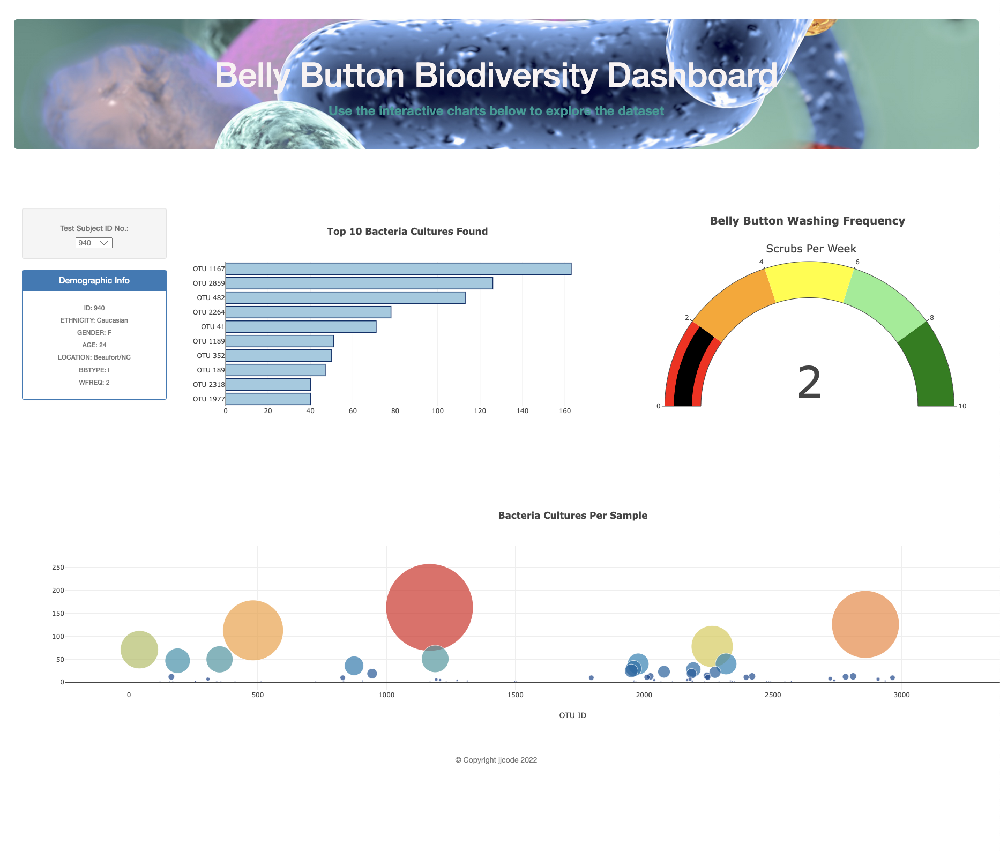

# Biodiversity

## Overview 
The goal of this project is to create an interactive dashboard to visualize the data collected for Belly Button Biodiversity. The data catalogs the microbes that colonize the human belly button. 

The data has found that more then 70% of particpants contained a small handful of microbial species (also called operational taxonomic units, or OTUs).

Demographics information is dynamically populated based upon a test subject ID. The dashboard has 3 types of charts:

- bar
- bubble
- gauge 

The dashboard was created with 
- Plotly.js  
- Javascript 
- Bootstrap 
- HTML5 
- D3.js

You can see the site here:https://jjcode-databootcamp.github.io/biodiversity/

